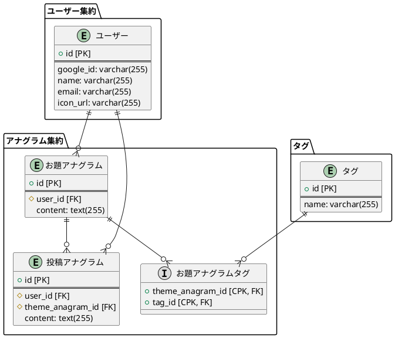

```puml
@startuml
/'色指定'/
!define INTER_MARK_COLOR dcdcdc

package "ユーザー集約" as user_aggregates {
  entity "ユーザー" as users {
    + id [PK]
    ==
    google_id: varchar(255)
    name: varchar(255)
    email: varchar(255)
    icon_url: varchar(255)
  }
}

package "アナグラム集約" as anagram_aggregates {
  entity "お題アナグラム" as theme_anagrams {
    + id [PK]
    ==
    # user_id [FK]
    content: text(255)
  }

  entity "投稿アナグラム" as posted_anagrams {
    + id [PK]
    ==
    # user_id [FK]
    # theme_anagram_id [FK]
    content: text(255)
  }

  entity "お題アナグラムタグ" as theme_anagram_tags <<I, INTER_MARK_COLOR>> {
    + theme_anagram_id [CPK, FK]
    + tag_id [CPK, FK]
  }

}

package "タグ" as anagrams_tags {
  entity "タグ" as tags {
    + id [PK]
    ==
    name: varchar(255)
  }

  /'リレーション'/
  users ||--o{ theme_anagrams
  users ||--o{ posted_anagrams
  theme_anagrams ||--o{ posted_anagrams
  theme_anagrams ||--o{ theme_anagram_tags
  tags ||--o{ theme_anagram_tags
}

@enduml
```

- E = Entity
- I = Intermediate table 中間テーブル
